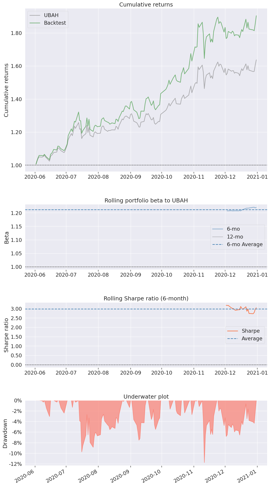

# Revisit Your Portfolio Optimization Efficiency

We develop an evaluation framework for the portfolio optimization problem.
This comes with 
- common benchmark
- metric set
- statistic tests

as these are lacking to date.

The goal is that you can run and compare your strategy here using the tools we provide.

## Requirements

To run the demo, you need to have only ```yfinance``` and ```pandas``` installed.
For more advanced features and visualizations, follow the messages.

## Features

In the respective directory, you find simple ```strategies``` to compare with and ```fintools``` to evaluate.

For example, yon can see a demo of mean reversion strategy by calling
```demo_mean_reversion()```

The output of a strategy is its weight vector [assets] over time [time], composed in a dataframe [time x assets].
For example:

| Date       | AAPL     | MSFT     | Sum |
|------------|----------|----------|-----|
| 2021-01-04 | 0.500000 | 0.500000 | 1.0 |
| 2021-01-05 | 0.500000 | 0.500000 | 1.0 |
| 2021-01-06 | 0.502831 | 0.497169 | 1.0 |
| ...        | ...      | ...      | ... |
| 2021-12-31 | 0.469052 | 0.530948 | 1.0 |


Likewise, the portfolio values and amounts are in shape [time x assets].

Given dataframes, you can easily visualize the performances with the ```pyfolio``` package.
To compare its tear sheat with the naive baseline:

```pyfolio.create_simple_tear_sheet(your_performance_dataframe, benchmark_rets=ubah_strategy.performance_dataframe)```



Please not this is WIP, no Release.
